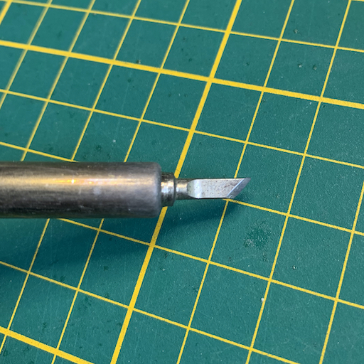
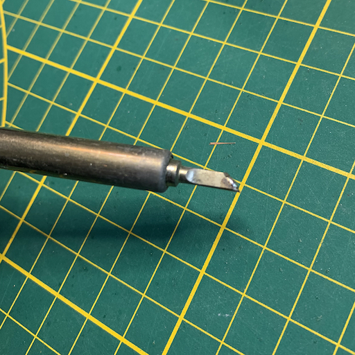
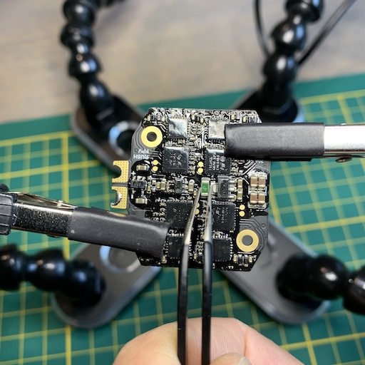
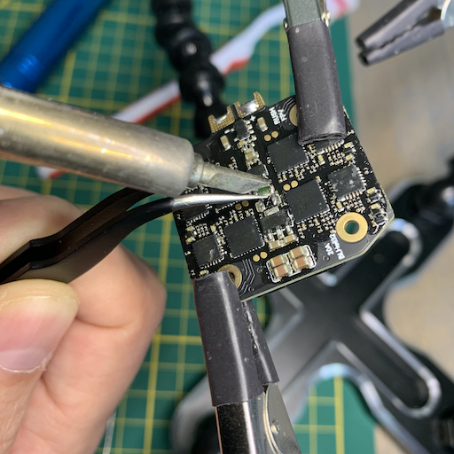
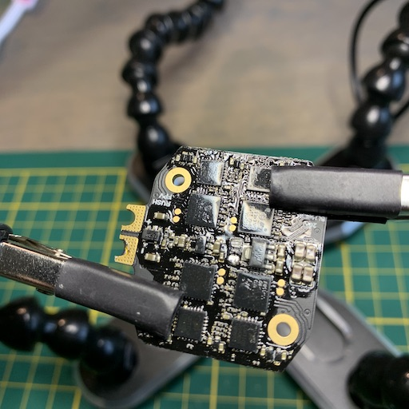
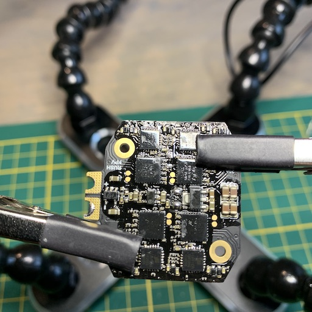
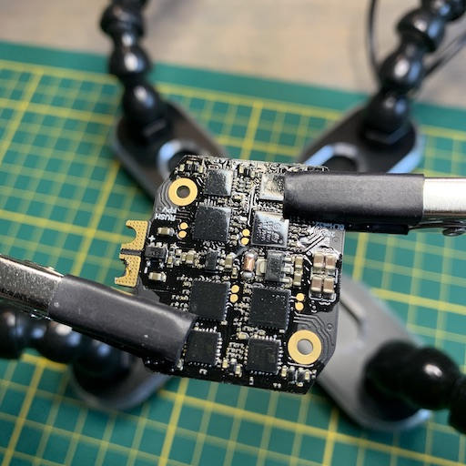
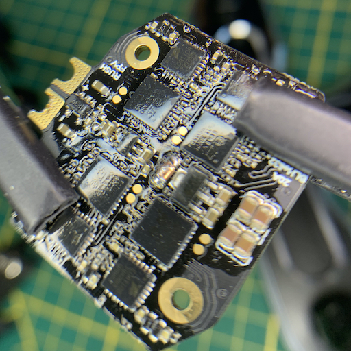

# ESC Fuse Fix

I ordered a bunch of `RushFPV Mini Tank Stacks` that were rated for `30 A` and connected them to some `DYS Samguk 2600 Kv`
motors _without propellers_. This minimal load blew the fuse on the ESC, making the ESC unusable.
The result was that BetaFlight showed `0.01 V` when a lipo was connected.

A friendly RushFPV customer support representative stated that this stack wasn't meant for `5"` quadcopters and motors with
such high `Kv` values. In my opinion, `30 A` is `30 A`, regardless of motor size, so I'm still under the impression
that this stack just can't deliver what it says on the specifications.
Thanks to the help of the RushFPV CSR, I was advised to bridge the fuse.
I was given some pictures as a guide, but decided to make a comprehensive photo write-up myself.

These are the tools that I used:

- ultra-fine tweezers
- soldering iron with (thin) chisel tip
- copper wire (preferably single core)
- clippers

If you plan to fix your own ESC, you should understand that removing the fuse (and shorting/bridging it) means that there is nothing preventing damage to the ESC if too much current is pulled through it. It can lead to smoke and fire if you abuse the ESC beyond its limits without this safety net.

First, let's take a look at the fuse itself. It's the green SMD component on the ESC:

As mentioned in the list of tools, I used a fine chisel tip:

Use the clippers to splice the wire length-wise. Then cut a smaller piece off that is a bit smaller than
the size of the fuse:

Have your soldering iron on high heat (I put mine on `425 C`) and add a little bit of solder.
This solder will help spread the heat on the SMD component:

Start holding the fuse with the tweezers. Don't put a lot of force on it, but make sure you grab hold of it:

Bring the soldering iron to the fuse (don't push hard) and gently pull the fuse off with the tweezers:

The ESC will now look like this:

Add some fresh solder to the fuse pads. I used the sharp end of the chisel tip to set down my iron
in a stable manner, and then I fed a little bit of solder into it:

Now place the tiny piece of copper wire, with the flat side down, between the ESC fuse pads.

Before you put the soldering iron down, make sure that you have some grip on the wire, as it will start
sliding a bit when the solder is flowing. To solder it, just put your iron down on the copper bit and
let the heat of the copper conduct into the solder and melt the solder into the copper:

That's it, you've now bridged the fuse!

You can test as follows:

1. Continuity test on fuse and ESC battery pads.
2. Power on the ESC with a battery and a smoke stopper. 
3. Remove battery power, add the FC and do another power on test with the smoke stopper.
4. Remove battery power, connect setup through USB, re-connect power (with smoke stopper) and verify the voltage readout in BetaFlight
