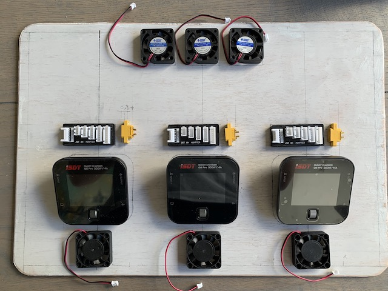
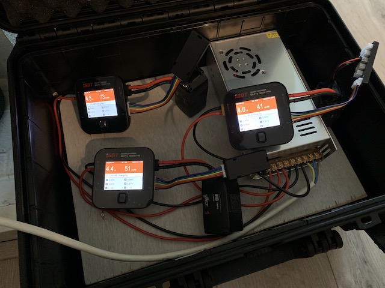

# Creating a battery charging case

This page will take you through the steps I took to create a charging case for 3 chargers.
I hope you enjoy reading about my successes, findings and failures.

**Materials used:**

- 3x compact lipo charger (ISDT Q6 in my case)
- a case that is large enough to hold everything (mine was `464 x 366 x 176 mm` internally, type "MAX 430S" on Amazon)
- various electrical wire (silicon sleeved, I used `14 AWG` for the power delivery spec that I wanted)
- 3x balance connector distribution board (search on AliExpress for "B6AC A6 Charger")
- power distribution board (optional)
- 6x `40 mm` fan (can be more/less, depending on your ventilation requirements)
- 6x fan cover (e.g. plastic mesh)
- switching power supply (`24 V` and `15 A`)
- top plate material (e.g. triplex)
- a bunch of XT60 and XT30 connectors, including 3x top-mounted XT60 (see pics below)
- `220 V` power outlet with switch and fuse (the same one as the Ender 3 Pro comes with)

(note: this might be incomplete)

**These are some of the tools that I remember using:**

- Soldering iron
- 3D printer (optional)
- Hot glue gun
- Wire cutters
- Knife
- Heat gun (optional)
- Tweezers and soldering stand
- Multimeter
- Something to cut out the top plate (e.g. drill, jigsaw and Dremel**

**I also designed some parts:**

- ISDT Q6 bracket: [STL](downloads/isdt_q6_bracket.stl), [FreeCAD](downloads/isdt_q6_bracket.FCStd)
- Balance board support plate: [STL](downloads/balance_board_plate.stl), [FreeCAD](downloads/balance_board_plate.FCStd)

These parts are optional, as you can also use pieces of wood or plexiglass to construct something similar.

The total cost as about EUR 250 with the ISDT chargers. Half of that amount was just the cost of the chargers,
so buying a cheaper charger could save some money. I also bought some components that were optional (PDB, more fans, etc.)
You could probably bring the total down to slightly below EUR 200 if you're making some different choices here and there.

# Steps

First, I bought a case. It was relatively cheap, and the only downside was that it is a bit heavy:

The next step was to start creating a bottom plate. I wanted to keep it detachable, so I bought some 3M Dual Lock.
I added a bit too much in retrospect, so when I detach the plate, sometimes the sticky tape comes off rather than the
Dual Lock:

On this bottom plate, I added the switching power supply. The main consideration here was to have it placed in such a way
that the combined airflow of the power supply unit (PSU) was working well with the airflow of the chargers. Another
consideration was how the placement would affect the center of gravity of the case, so it would be nice to carry.

I mounted the PSU on the wooden plate with standoffs, so that the airflow would be better. I also wanted to make sure that
if the power supply ever got really hot (which I don't expect), it wouldn't be touching the wood:

Here it is placed in the case:

Similarly, I created a top plate. It rests nicely on the rim of the case, and due to the design of the case, the lid
still closes perfectly.

I drew some edges on it, to visualize how much actual space was usable. That way, I wouldn't be hitting the side of the case:

I made many sketches on paper before picking my preferred layout. I laid some of the components on the paper to see if it would
work well. The considerations were: airflow, wire connections (amount of wire needed), space during charging (how close is
everything to each other).

After that was done, I transferred my layout to the top plate:

And of course I verified it by adding the components on top:

At this point, I started prepping wires already. This would allow me to already connect the chargers and start charging.
That way, I didn't have to wait to the end of the project until I'd have a functioning charging setup!

As you can see, the rig was already functionally usable:

I wanted a single wire to go from the PSU to the rest of the electronics. This allows me to easily disconnect the electronics
on the top plate from the PSU on the bottom for maintenance and testing. In theory, I could just solder all the XT60 connectors
together, in parallel, and be done with it. I chose another path and bought a power distribution board (PDB) to make the job a bit prettier.
This PDB also comes with a BEC, so I could easily add some LEDs to the case later, or add more electronics that require a lower voltage.

To this PDB, I added some extra BECs (step down converters) that will drive the fans. They are separate, as I need more current from it
than the PDB will give me. The BECs allow me to regulate the voltage, effectively allowing me to change the speed of the fans.

I am adding XT60 and XT30 connectors, because I want the entire thing to be modular and easy to disassemble:

Originally, I had only 1 BEC. This provided insufficient power to start rotating all fans at the same time.
I added a second BEC to solve this problem, but in the end it was still insufficient. The proper fix would be to have a setup
where each fan gets its own switch. That way, they can all individually get their needed current spike to start spinning - but
not at least not at the same time!

At this point I started cutting out the top plate:

Because I used triplex wood, and I'm not super experienced with it, the wood partially disintegrated when cutting into it.
I used some 2 component epoxy filler to fix most of it:

To finish the top plate, I painted it black:

Also the fans were mounted:

Then the XT60 top-mounted connectors were added:

Because the chargers were shaped irregularly, and I needed to support the balance boards with something, I designed and
printed out some parts. You can also buy some wood or plexiglass and cut out similar parts by hand. I used 2 component
epoxy filler (yes, filler) to glue the charger brackets on:

Then I put the balance charging cables in place and glued in the supports for the balance board:

The lasts step was to connect everything:

And then the project was finished:

