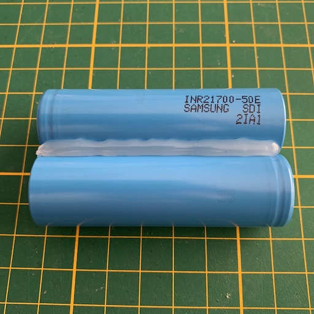
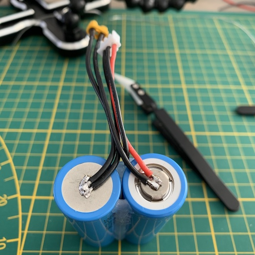
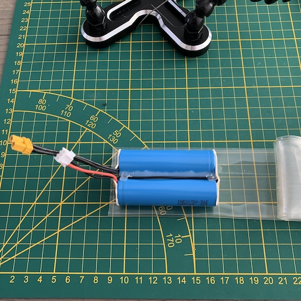

# Making a Li-Ion battery pack

This page shows the steps involved in making a `2S` pack with `21700` cells.
This guide is also relevant for constructing with `18650` cells.

Materials needed:
- 2x `18650` or `21700` cells (they must both be exactly the same cell!)
- Large shrink tube (alternative: electrical tape)
- A balance plug and wire for it (or balance extension cord that you cut)
- 18 AWG wire (can be thicker if you need more amps)

Let's first list the tools that I used:

- Soldering iron
- Hot glue gun
- Wire cutters
- Knife
- Heat gun (optional)
- Tweezers and soldering stand (optional)
- Multimeter

# Before you begin

Making a battery pack is dangerous. Ensure that you have a basic understanding electricity and lipo & li-ion battery tech.
This guide might not be perfect, so proceed at your own risk.
Using battery cells incorrectly may lead to fire and physical harm. Treat them with the respect that they deserve.
The author is not responsible for any damage or harm that may happen from following the steps in this document.

# Steps

First we start with two identical cells. These are Samsung `INR21700-50E` cells:

You can find the specifications of these cells [here](https://lygte-info.dk/review/batteries2012/Samsung%20INR21700-50E%205000mAh%20(Cyan)%20UK.html).

Before we actually start, please note that all wires should be pre-tinned.
This will make it much easier to combine the components:

Now put the cells together. They must touch each other. I used 2 coasters to help me with that.
You can then use a tool to align them vertically:

Carefully apply hot glue on one side of the cells. Make sure your glue gun doesn't touch the cells,
so you don't melt the plastic wrapper. Let it dry for 30-60 seconds and then do the other side too:

Since I don't have a spot, I need to solder them regularly.
Before we can add solder to the cells, we need to remove the oxidised layer from the cells.
I do this by scraping carefully with a knife. But the cell flat on the table and start scraping at
the center of the contact point.

Heat the soldering iron to `450 C` (`842 F`). Less might also work, but this is the temperature that I used.
Put some solder on your iron, then put the soldering iron on the cell, then add a bunch more solder:

Let it cool and then clean off the resin:

You can test the strength of your weld by applying force with a knife on the edge of the solder.
I had to hold my camera to take a picture, but you should hold the batteries with one hand, and then carefully
apply a few kilograms of force with the other hand. Be careful to not cut yourself.

Repeat the knife scraping, soldering, cleaning and strength testing for all 4 contact points:

Cut a small piece of wire to length to connect 2 battery cells in the back:

Make a `2S` (3-pin) balance cable to length, or cut one from an existing balance extension cable:

Solder the center cable of the balance connector to the back of the battery:

Fasten the balance cable with some hot glue. This will make it easier to work with:

Measure and cut the remaining 2 wires of the balance cable. Make sure the red cable goes
to the positive side of the cell, and the black cable goes to the negative side of the other cell:

Then solder the two balance cables onto the cells:

Now solder an XT30 connector to the same contacts:

We're about to make some covers to protect the top and bottom of the battery pack.
Take some double-sided tape, cut it to length. Then apply kapton tape (or electrical tape?) on one side.

Measure some shrink tube. It should stick out about 8-10mm on each end of the cells:

Hold the lipo by all of its wires and use the heat gun to carefully heat the shrink tube.
Your pack is now finished:

Since we used Samsung `INR21700-50E` cells, this battery pack is a `2S` pack with `5000 mAh`. Even though these are `Li-Ion` cells, they are charged to `4.2 V`. The cut-off voltage is a mere `2.5 V`! You can charge at maximum `4900 mA`, but it's advised to charge them slower. They can be discharged at `9800 mAh` continuously, or `14700 mA` pulse. (according to [this page](https://lygte-info.dk/review/batteries2012/Samsung%20INR21700-50E%205000mAh%20(Cyan)%20UK.html))

When using different cells than the ones above, make sure to look up the the specifications of these cells.
The voltages and currents will very likely be different.

